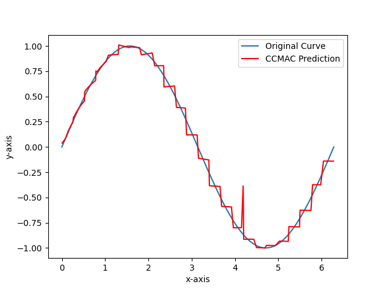

# Torch-CMAC
Cerebellar Model Articulation Controller (CMAC) implemented using PyTorch. GPU parallel computing can be implemented. 使用PyTorch实现的小脑模型关节控制器(CMAC)。可进行GPU并行计算。

List of files:
torch_dcmac.py: discrete CMAC model implemented in PyTorch, with test code.
torch_dcmac.png: output of torch_dcmac.py.
torch_ccmac: continuous CMAC model implemented in PyTorch, with test code.
torch_ccmac.png: output of torch_ccmac.py.

文件列表：
torch_dcmac.py: 使用PyTorch实现的离散CMAC模型，以及测试代码。
torch_dcmac.png: torch_dcmac.py的输出。
torch_ccmac: 使用PyTorch实现的连续CMAC模型，以及测试代码。
torch_ccmac.png: torch_ccmac.py的输出。

